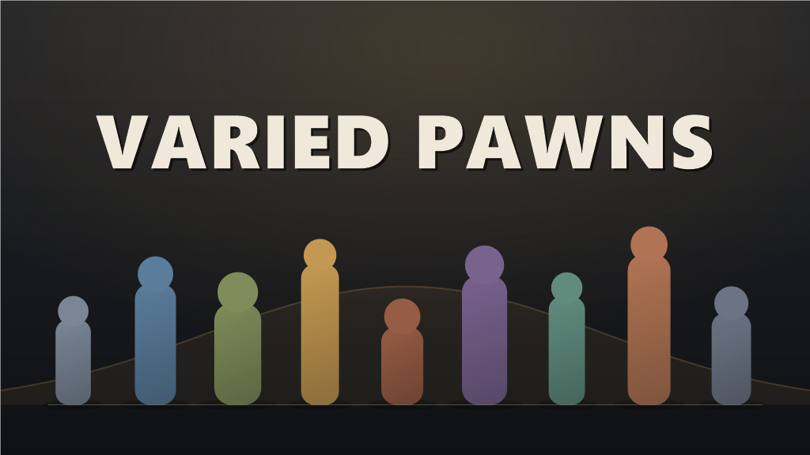

# Varied Pawns

A RimWorld 1.6 mod. Two vanilla colonists of the same type are more alike than they should be —
Varied Pawns widens that band and hands you the dial.



Every pawn rolls a single hidden quality value at generation, and that one roll drives its skill
levels, how many traits it gets and its passion budget **together** — so a lucky pawn is good at
things *and* driven about them, rather than three unrelated numbers. It changes how many traits a
pawn gets, never which ones; trait selection stays entirely vanilla's.

- **Eight presets**, from `Faithful` (close to unmodded) through `Desperate`, `Scavenger`,
  `Specialist`, `Elite` and `Sovereign`, plus `Distinct` and `Wildcard` for spread rather than
  strength.
- **A profile editor** with a live distribution curve and a power readout, so you can see what a
  slider actually does before you commit to it.
- **Per-faction, per-race and per-xenotype overrides** with priority levels, so raiders, tribes and
  imperial nobles feel different from the start.
- **Children are left alone** unless you turn them on.

**Safe to add mid-save** — it affects newly generated pawns, so existing colonists are unchanged.
**Safe to remove too**: the mod writes nothing into your save, so taking it out leaves no orphaned
data and no load errors.

## Installing

**From Steam:** subscribe to the Workshop item. <!-- TODO: link the Workshop item here once it
exists. This is the last piece of pre-publish item 13 and it cannot be filled in before the first
upload. -->

**Without Steam:** download the latest `VariedPawns-<version>.zip` from
[Releases](https://github.com/kalas1230/Rimworld-Pawn-variance-mod/releases) and extract the
`Varied Pawns` folder into your RimWorld `Mods` folder, so you end up with
`Mods/Varied Pawns/About/About.xml`. Cloning this repository does **not** give you a playable mod —
`Assemblies/` is gitignored, so there is no compiled DLL in a clone. Take the zip, or build it.

**Requirements:** RimWorld 1.6 and
[Harmony](https://github.com/pardeike/HarmonyRimWorld/releases/latest). Biotech is optional — the
xenotype override axis is skipped without it, and everything else works regardless.

## Bugs and questions

[Open an issue](https://github.com/kalas1230/Rimworld-Pawn-variance-mod/issues) with your RimWorld
version, your mod list, and what you expected versus what happened.

## License

MIT — see [`LICENSE`](LICENSE).

---

# Developer documentation

**Everything below is for people and agents working on the mod** — layout, build, the verification
harness and the invariants that are easy to break. The player-facing text lives above, in
`About/About.xml`'s `<description>`, and in the Steam Workshop description. Those are written for
someone deciding whether to subscribe, not for someone editing `DispersionModel.cs`. Do not merge
the two.

**Status: unreleased.** Nothing is published. There are no existing users and no
backward-compatibility obligation — do not add migration shims. If a saved config breaks, the fix is
to reset it. That stops being true the day this ships.

---

## Start here

| If you are… | Read |
|---|---|
| Making any change at all | [`HANDOVER.md`](HANDOVER.md) — the durable reference. Not a changelog; git holds history. |
| Touching the scoring model | `HANDOVER.md` § *The scoring model* and § *Mandatory architectural rules*, then run the gates below. **Retuning is where this project has shipped its worst defects.** |
| Touching traits | [`TRAIT-DESIRABILITY-RESEARCH.md`](TRAIT-DESIRABILITY-RESEARCH.md) — seven rejected approaches, with data. More traits is *worse*, and trait count must never re-enter the composite score. |
| Wondering why something is the way it is | `docs/AUDIT-2026-08-06-problem-register.md` and `docs/AUDIT-2026-08-09-problem-register.md`, then `docs/superpowers/specs/` and `docs/superpowers/plans/`. |

`HANDOVER.md` is long because the alternative was relearning the same facts. Most of it exists
because something already went wrong once.

---

## Layout

```
About/                 Mod metadata. About.xml is the player-facing description.
Assemblies/            Build output. GITIGNORED — a fresh clone is not a playable mod.
Languages/English/     Keyed/VariedPawns.xml — every player-visible string. Ships.
Source/                C# (net472, LangVersion 9). Builds to ..\Assemblies\.
docs/                  Specs, plans, audit registers.
docs/tools/            envelope_check.py (the gate) and dispersion_mc.py (Monte Carlo).
tools/                 build-release.ps1 (stages the uploadable folder, and -Check
                       re-validates an existing staging) and check-translation-keys.ps1.
temp/                  Scratch logs. Gitignored.
zzz-Do-Not-Commit/     Local-only scratch, gitignored. Never committed.
HANDOVER.md            The durable reference.
```

The repo root doubles as a working mod folder: RimWorld ignores `Source/`, `docs/` and the rest, so
the tree loads in-place for development. **That is why the release must be staged rather than
uploaded from here** — see *Releasing*.

---

## Build and deploy

```powershell
tasklist /FI "IMAGENAME eq RimWorldWin64.exe"   # must show no running instance
dotnet build Source/PawnVarianceMod.csproj
$dep = "C:/Program Files (x86)/Steam/steamapps/common/RimWorld/Mods/PawnVarianceMod"
Copy-Item Assemblies/PawnVarianceMod.dll, Assemblies/PawnVarianceMod.pdb "$dep/Assemblies/" -Force
Copy-Item About/About.xml, About/LoadFolders.xml, About/Preview.png, About/ModIcon.png `
  "$dep/About/" -Force
```

- **Copy `About/` too, not just `Assemblies/`.** This step was missing for a long time, and the
  consequence was invisible: the deployed mod had a stale `About.xml` and neither image, so the
  logo and the title card never appeared in game no matter how many times they were regenerated.
  `tools/build-release.ps1` always packaged `About/` correctly, so **only the dev deploy was
  affected** — the release zip was never wrong.
- Check for a running RimWorld before copying, or the DLL copy fails on a file lock.
- `About/` changes need a **full game restart** to show; there is no reload for mod metadata.
- `dotnet build` must return `0 Error(s), 0 Warning(s)`.
- Reference paths are overridable: `-p:RimWorldDir=…` and `-p:HarmonyModDir=…`.
- Debug and Release both write to `Assemblies\`. A DLL is a DLL; know which one is sitting there.

**A clean build proves nothing about this mod.** Every serious defect in its history compiled
without a warning. See *Verification*.

---

## Verification

There is **no unit-test project, and that is a decision rather than a gap** — the interesting code is
`Pawn`-coupled, so an out-of-game double would test a copy of the logic instead of the logic. The
harness is one offline tool plus two dev-mode debug actions, all under the `Varied Pawns` category
(RimWorld gates the debug menu behind `Prefs.DevMode`, so players never see them).

**Offline — run on every scoring change:**

```powershell
python docs/tools/envelope_check.py
```

Deterministic integration, no third-party dependencies. It parses `Source/Constants.cs` and
`Source/VarianceProfile.cs` directly, so it cannot drift from what ships. Exits non-zero on a Rule 1
or Rule 2 violation, so it can gate a commit, and it regenerates `Source/EnvelopeFigures.g.cs`
(checked in, auto-generated, **never** hand-edited — if `git status` shows it dirty after a run, the
shipped figures were stale, so commit it).

**In game — the part that actually catches things:**

1. `Verify Best-of-N against envelope_check.py` — diffs the mod's live integrator against the
   generated reference for all 8 presets × N = 1, 5, 25, 50, asserts both sides ran the same
   quadrature grid, and checks the scoring constants against a snapshot taken at generation time.
2. `Roll pawns and dump distribution` — generates 50/200/1000 pawns through the real
   `PawnGenerator.GeneratePawn` path. **The only place dispersion can be observed rather than
   derived**, and the only thing that can catch a generator branch no model mirrors.

> **Rule 6: after any scoring-constant change, run both.** The offline tool and the in-game gate are
> not redundant. The gate can only ever prove the two *model* implementations consistent with each
> other; anything the *generator* does that no model mirrors is invisible to it. That exact failure
> has happened more than once — most memorably when `Wildcard` breached the ±35% envelope while the
> gate read green, because the gate was checking agreement rather than correctness.

---

## Mirrored implementations — change one, change all

The C#/Python duplication is deliberate (custom profiles need a live figure no precomputed table can
cover) and it is the single most reliable way to introduce a silent defect here. These sites
implement the same quantity and must be edited together:

| Quantity | Sites |
|---|---|
| Composite score | `PawnVarianceSettings.CalculateCompositeScore` · `make_composite` (`envelope_check.py`) |
| Dispersion moments | `DispersionModel.Moments` · `grid_moments` (`envelope_check.py`) |
| Passion spend loop | `PassionSpend.cs` · `make_spend` (`envelope_check.py`) · `dispersion_mc.py`'s `simulate` — the only place the loop actually runs |
| Vanilla passion floor | `PassionVarianceApplier` (the generator) · `DispersionModel.Moments` · `grid_moments` · `dispersion_mc.py` |

`envelope_check.py`'s grid constants (`QGRID`/`XGRID`/`TGRID`/`GGRID`) must equal
`DispersionModel`'s (`QNodes`/`XNodes`/`TriNodes`/`GaussNodes`). The in-game gate asserts this; a
one-node drift stayed inside every numeric tolerance and was caught only by that equality check.

---

## Invariants worth knowing before you touch anything

Full statements and their histories are in `HANDOVER.md`; this is the index.

- **±35% envelope (Rule 1)** — every preset stays within ±35% of `Faithful` at N = 1, 5, 25, 50.
- **Monotonic power-tier ordering (Rule 2)** — `Desperate < Scavenger < Faithful < Specialist <
  Elite < Sovereign`. `Distinct` and `Wildcard` are variance presets and exempt from ordering, **not**
  from the envelope.
- **Trait count never re-enters the composite score.**
- **Children are untouched by default** — `applyVarianceToChildren` and `applyChildSkillShift` are
  both `false`.
- **`Constants.MaxPassionPips` must stay a numeric literal** — `envelope_check.py` parses it with a
  regex that only accepts `public const float X = <number>f;`. An expression there breaks the tool.
- **`DrawRaceOverridesSection` is not gated on Biotech** — only the xenotype section is. HAR race
  mods do not depend on Biotech; gating race there silently kills the feature for its users.
- **`Widgets.IntRange` is forbidden on the four min/max pairs** — `passionCountMin`/`Max` hold
  fractional calibrated values and `IntRange` would silently truncate a governed number.
- **Rule 5: mandatory consultation.** Percentage bounds, statistical scaling, children/growth
  defaults and profile parameters need explicit owner approval.

---

## Releasing

```powershell
.\tools\build-release.ps1 -Build -Zip
```

Stages `Release/Varied Pawns/` containing only `About/`, `Languages/`,
`Assemblies/PawnVarianceMod.dll` and `LICENSE` — 7 files. The copy list is an allowlist, so a new
folder stays out of the release until it is added to `$ShipDirs`. The staging folder is gitignored
and rebuilt from scratch on every run — never hand-edit it. **Point the Steam uploader at the staged
folder, not at the repo root**; the root would ship `docs/`, `temp/`, `Source/obj/` and
`zzz-Do-Not-Commit/`.

The script hard-fails on a missing `About/Preview.png`, a missing assembly, and on a DLL older than
the newest `.cs` file (the stale-build catch), and it strips `.pdb`. Re-run both gates against the
staged DLL before publishing.

```powershell
.\tools\build-release.ps1 -Check
```

**Run this immediately before any upload.** Staging has an indefinite shelf life and no freshness
guarantee of its own: the stale-build catch above compares the *repo* DLL against `Source/` and only
runs when you re-stage, so it says nothing about a folder that has been sitting there since last
week. `-Check` re-validates an existing staging against the current repo by SHA-256, every shipped
input rather than just the DLL, without rebuilding anything. It has already caught a stale
`About.xml`, a stale DLL and an entirely missing `Languages/` folder in one run.
`Release/staging.stamp.json` records which commit a staging came from; it sits outside the staged
folder on purpose, because everything inside it gets uploaded.

Because `Assemblies/` is gitignored, **cloning this repo does not give you a playable mod** — build
it, or take the zip from a GitHub Release.

---

## Conventions

- **Generated files are never hand-edited.** `Source/EnvelopeFigures.g.cs` comes from
  `envelope_check.py`. Regenerate, don't patch.
- **Numbers in `HANDOVER.md` are pasted tool output, not typed.** If a figure moves, regenerate the
  generated file and every pasted table in the same change.
- **Scratch files go in `zzz-Do-Not-Commit/`.** It is ignored via the tracked `.gitignore`, so every
  clone inherits the rule — it used to live only in `.git/info/exclude`, which is local to one
  working copy and protected exactly one machine.
  `zzz-Do-Not-Commit/TestOnly_PlayerColonyXenotypes.xml` is a test fixture that must never ship.
- **Player-visible strings go in `Languages/English/Keyed/VariedPawns.xml`, never inline.** Run
  `tools/check-translation-keys.ps1` after touching either side: a key used in code but missing from
  the XML does not throw and does not fail the build — RimWorld renders the raw key text where the
  label should be. Note that text reaching the UI through `enum.ToString()` has no literal to grep
  for and is easy to miss; see `HANDOVER.md` item 9.
- **`.superpowers/sdd/progress.md` is gitignored and overwritten in place** by each batch, so its
  task numbers always refer to the current batch. Findings worth keeping get promoted into the audit
  registers in `docs/`.
- **Refer to profiles by display name** (`Faithful`, `Wildcard`), not by C# variable name
  (`VanillaLike`, `WildSpread`). The mapping table is in `HANDOVER.md` § *Profiles*.
- **Measure, don't predict.** "Should be fine" is not a verification result, and this project has a
  documented history of green gates over broken behaviour.

---

## Compatibility

The player-facing summary is at the top of this file; these are the parts that matter when changing
the code.

- **RimWorld 1.6 only.** 1.5 is not built or tested against and is **not claimed** — `About.xml`'s
  `supportedVersions` and `LoadFolders.xml` must keep agreeing about that.
- Biotech is optional. Only the *xenotype* section is gated on it —
  `DrawRaceOverridesSection` deliberately is not, because HAR race mods do not depend on Biotech and
  gating race there would silently kill the feature for its users.
- Known limitation: Milian pawns (Milira) are unreachable by race override. They are produced in
  code rather than from a `PawnKindDef`, so the Add-menu filter cannot see them. Closed as
  won't-fix; the reasoning is in `HANDOVER.md`.
